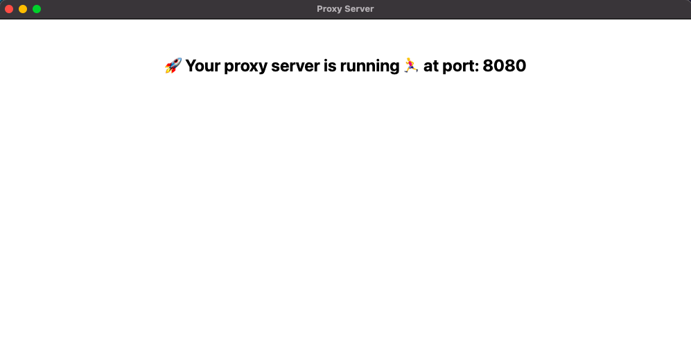
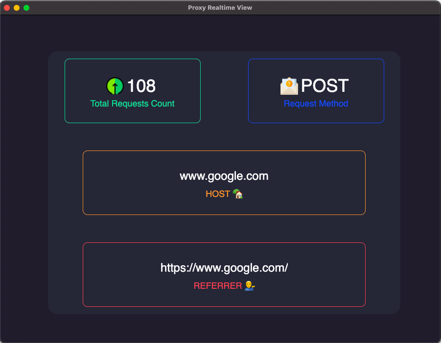

# Electron.js Proxy Server
## _See your data_

### Steps to use this app

### 1) Download this repo using and cd into it
```
git clone https://github.com/shivam-bit/Electronjs-proxy-server.git
```
### 2) Install all the dependcies and run server for the first time
```
npm i 
npm start
```

### 3) A folder named ".http-mitm-proxy" will automaticalley be created which contains a folder "/certs" . This folder will contain a file named as "ca.pem" copy this file and install this certificate as a trusted certificate.
### 4) Now re-run the server
```
npm start
```



